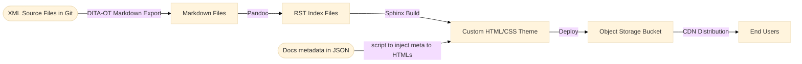

# Implementing Docs as Code
## Background

Our documentation system previously relied on a **commercial XML source control, authoring, and publishing suites**.  
The workflow included XML-based authoring in an editor and publishing HTML/PDF outputs using a dedicated publishing pipelines.

While the system was robust and feature-rich, it introduced limitations:

- **Limited ownership** – The platform was controlled externally, restricting our ability to customize workflows or add features.  
- **Dependency for metrics** – Accessing performance analytics required vendor assistance.  
- **Feature bottlenecks** – Introducing new functionality was slow and inflexible.

To address these issues, a new **Docs as Code** strategy was designed, leveraging open-source tools, version control, and cloud delivery pipelines.

## Strategy Overview

The goal was to unify tools, reduce dependencies, and bring full control of the documentation workflow in-house utilizing the same principles, tools, and workflows as software code.

## Example Workflow Diagram



Two approaches were considered:

**Option 1 – Direct HTML generation with DITA-OT**  
- Use DITA-OT’s built-in arguments instead of custom plugins. For example, `args.hdf`, `args.hdr`, `args.ftr`, and `args.css`. 
- Apply custom CSS, metadata, and structural adjustments through configuration parameters.  
- Reduced complexity compared to maintaining custom publishing plugins.

**Option 2 – XML to Markdown, then Markdown to HTML with Sphinx**  
- Use DITA-OT to convert XML sources to Markdown.  
- Process Markdown files with Sphinx for final HTML rendering.  
- Aligned all source files into a lightweight, Git-friendly format and simplified future tooling changes.

**Decision:** The second option was chosen for its simplicity, transparency, and ease of integrating automation.

## Final Implementation

### 1. Conversion from XML to Markdown
```bash
dita --input=my_ditamap.ditamap --format=markdown --output=./output_folder
````

### 2. Preparing Sphinx Inputs

```bash
pandoc --from=markdown --to=rst --output=output.rst input.md
```

### 3. HTML Rendering with Sphinx

* Customized the Sphinx theme to match production site styling.
* Applied CSS and HTML overrides to minimize visible changes.

### 4. Inject metadata to HTMLs
* Guides metadata is saved in a JSON file which includes details of creation date, modified data, author name, versions, document template, and other crucial details.
* Use script to inject the metadata to each HTML.

### 5. Cloud Hosting & Delivery

* Published HTML pages to an object storage bucket.
* Configured WAF.
* Distributed via CDN for high availability and low latency.
* Updated DNS to switch production domains to the new pipeline.

## Benefits

* **Full control of tooling** – No vendor lock-in.
* **Version-controlled content** – Transparent history and collaboration in Git.
* **Reduced complexity** – No custom publishing plugins.
* **Future extensibility** – Easy to add validations, linters, AI-assisted authoring and many more.

## Learning

* Start with a proof-of-concept before a full migration.
* DITA-OT custom plugin is complex and buggy, use inbuilt DITA parameters for customization. 
* Use scripts to automate everything possible.
* Move the source and scripts to git for testing instead of local. It will help with collaboration and wider testing scenarios.
* Document your scripts and pipelines for clarity and quick onboarding.


## What’s Next

* Add automated validations for formatting, link integrity, and terminology.
* Explore AI-assisted authoring and review agents.
* Build an internal analytics dashboard.

## References

* [DITA Open Toolkit Parameters](https://www.dita-ot.org/dev/parameters/parameters-html5#html5)
* [Pandoc](https://pandoc.org/)
* [Sphinx Documentation](https://www.sphinx-doc.org/)

```html
<script type="module">
  import mermaid from 'https://cdn.jsdelivr.net/npm/mermaid@10/dist/mermaid.esm.min.mjs';
  mermaid.initialize({ startOnLoad: true });
</script>
```
